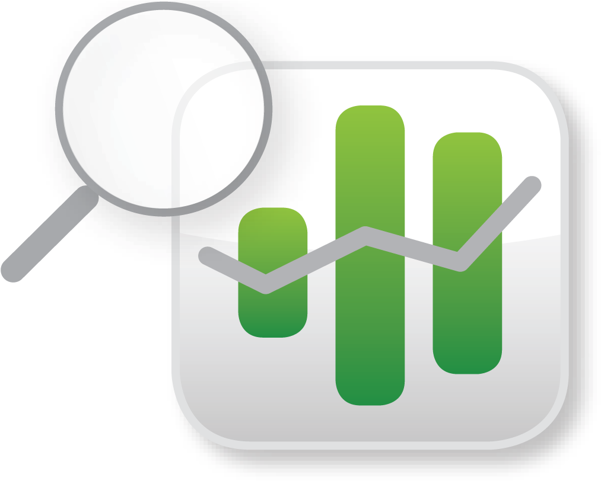

<!-- PROJECT LOGO -->
 

  

  <h3 align="center">The Best BNF Dashboard ever created</h3>

  

    An awesome Dashboard
     
    <a href="https://github.com/eedrobup/cyan"><strong>Explore the codes »</strong></a>
     
     
    <a href="https://github.com/eedrobup/cyan">View Demo</a>
    ·
    <a href="https://github.com/eedrobup/cyan/issues">Report Bug</a>
    ·
    <a href="https://github.com/eedrobup/cyan/issues">Request Feature</a>
  

<!-- TABLE OF CONTENTS -->

  
Table of Contents

  <ol>
    <li>
      <a href="#cyan-dashboard">Cyan Dashboard</a>
      <ul>
        <li><a href="#features">Features</a></li>
        <li><a href="#data-used">Data Used</a></li>
      </ul>
    </li>
    <li>
      <a href="#getting-started">Getting Started</a>
      <ul>
        <li><a href="#running-the-dashboard">Running the Dashboard</a></li>
        <li><a href="#testing-the-dashboard">Testing the Dashboard</a></li>
      </ul>
    </li>
    <li><a href="#scrum-team-details">Scrum Team Details</a></li>
  </ol>

<!-- CYAN DASHBOARD -->
## Cyan Dashboard

[![Product Name Screen Shot][product-screenshot]](https://example.com)

Cyan is a dashboard that shows insights regarding drug prescription. It serves to help members of the clinical commissioning group:

* Assess local needs
* Rank priorities and develop strategies to meet the public's medical needs
* Distribute the NHS budget given to their CCG a) Buying services on behalf of the population from providers including hospitals, clinics, community health bodies, etc
* Ensuring the services and pathways in which medicines are utilized are set to standards that provide cost-effective use of resources, reduced risks associated with medicines use, and improved patient outcomes.

### Features

All the features displayed on the dashboard:

* Average actual cost
* Description of the max quantity item
* Percentage of the top prescribed drug among all the prescriptions
* Number of unique items in the data
* A creatinine clearance calculator acting as a clinical support tool for physicians.
* Details about the purpose of your dashboard, explanation about features and data used with details of the team.
* Percentage of infection treatment drug out of all infection treatments 

### Data Used

The data that drives the data dashboard is the practice level prescribing data provided by NHS Digital.

https://digital.nhs.uk/data-and-information/areas-of-interest/prescribing/practice-level-prescribing-in-england-a-summary/practice-level-prescribing-data-more-information

(<a href="#readme-top">back to top</a>)

<!-- GETTING STARTED -->
## Getting Started

conda install flask
conda install flask-sqlalchemy
conda install nose2
git clone https://github.com/eedrobup/cyan.git
cd cyan

### Running the Dashboard

Open terminal and run the following commands:
cd cyan
python run.py

### Testing the Dashboard

cd cyan
nose2

(<a href="#readme-top">back to top</a>)

<!-- Scrum Team Details -->
## Scrum Team Details

- Pubordee Aussavavirojekul
- Alix Har
- Nishat Girkar
- Tech Onn Ding
- Franklin Rajadurai
- Halimah Fetuga

(<a href="#readme-top">back to top</a>)

